# HopfieldFPGA
## Описание
Реализация сети Хопфилда на языке Verilog HDL для синтезирования на отладочной плане Terasic DE1-SoC. Передача входных и выходных данных на плату производится с использованием последовательного порта (UART). В репозитории содержится исходный код на языке Python для формирования весов сети и для обмена данными с платой с использованием последовательного порта (директория python_src), исходный код модулей на языке Verilog HDL, реализующий функции сети и передатчика (директории verilog_src и misc), а также данные для проверки работоспособности (директории data, tb и scripts). 

## Теоритическое введение
### Сеть Хопфилда

Сеть Хопфилда представляет из себя автоассоциативную сеть, способную выполнять функцию памяти. Основным применением сетей Хопфилда является восстановление образцов, ранее сохраненного сетью, по подаваемому на вход искаженному образцу [[1](https://microtechnics.ru/nejronnaya-set-xopfilda/)][[2](https://youtu.be/W7ux1RfOQeM)]. 

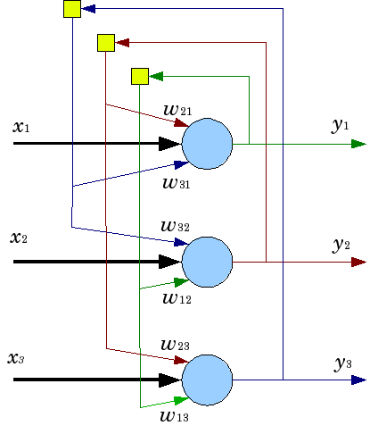

В каждый момент времени выход нейрона S может быть либо -1, либо +1, и вычисляется следующим образом [[3](https://habr.com/ru/post/301406/)]:

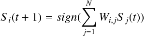

где:
- i, j — номера нейронов от 1 до N;
- S (t) — выход нейрона в текущий дискретный момент времени (при t = 0 S формируется входным вектором);
- S (t + 1) — выход нейрона в следующий дискретный момент времени; 
- W — квадратная матрица весов связей между нейронами размером N на N элементов. 
- sign(x) — функция определения знака числа x. При x > 0 sign(x) возвращает +1, при x < 0 возвращает -1. Примем, что при x = 0 функция примет значение +1.  

Для обучения сети требуется вычислить значение каждого элемента матрицы весов:

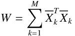

где:
- W — матрица весов связей;
- M — общее число образов;
- k — номер образа, который требуется "запомнить";
- X — образ, который требуется "запомнить".

Причем каждый элемент главной диагонали требуется обнулить [[2](https://youtu.be/W7ux1RfOQeM)].

Расчет выходов сети требуется продолжать до тех пор, пока выход в прошлый момент времени не совпадет с выходом в текущий момент времени.

### Последовательный интерфейс UART

**Универсальный асинхронный приёмопередатчик** (УАПП, англ. *Universal Asynchronous Receiver-Transmitter*, *UART*) — узел вычислительных устройств, предназначенный для организации связи с другими цифровыми устройствами. Преобразует передаваемые данные в последовательный вид так, чтобы было возможно передать их по одной физической цифровой линии другому аналогичному устройству. Метод преобразования хорошо стандартизован и широко применяется в компьютерной технике (особенно во встраиваемых устройствах и системах на кристалле (SoC)).

UART может представлять собой отдельную микросхему (например, Intel I8251, I8250) или являться частью большой интегральной схемы (например, микроконтроллера). Используется для передачи данных через последовательный порт компьютера, часто встраивается в микроконтроллеры[[4](https://ru.wikipedia.org/wiki/Универсальный_асинхронный_приёмопередатчик)].

#### Метод передачи и приема

Передача данных в UART осуществляется по одному биту в равные промежутки времени. Последовательность битов определенной длины скрадывается в слово. Временной промежуток, который отвечает за длительность передачи одного бита определяется скоростью UART, которая может быть выбрана среди ряда стандартных скоростей (300; 600; 1200; 2400; 4800; 9600; 19200; 38400; 57600; 115200; 230400; 460800; 921600 бод) и для конкретного соединения устанавливается заранее.

Слово передачи UART помимо битов иформации включает биты начала и окончания передачи. Также возможно использования бита четности для проверки корректности передачи. После передачи служебные биты удаляются потока данных.

Принято соглашение, что при отсутствии информации для передачи состоянием входа и выхода UART является логическая 1. Передача начинается с по]вления стартового бита (логического 0), поэтому приёмник UART ожидает перехода из 1 в 0 и отсчитывает от него временной промежуток в половину длительности бита (середина передачи стартового бита). Если в этот момент на входе всё ещё 0, то запускается процесс приёма. Для этого приёмник отсчитывает 9 битовых длительностей подряд (для 8-битных данных) и в каждый момент фиксирует состояние входа. Первые 8 значений являются принятыми данными, последнее значение проверочное (стоп-бит). Значение стоп-бита всегда равно 1. Если реально принятое значение иное, фиксируется ошибка. Для отсчета требуемых временных интервалов требуется источник тактовых импульсов как на приемнике, так и на передатчике.


Для реализации передачи отдельных байт памяти использовался исходный код из [[5](https://www.nandland.com/vhdl/modules/module-uart-serial-port-rs232.html)]

## Запуск и проверка
### Требования
Для запуска и проверки требуется следующее программное и аппаратное обеспечение:
- ОС Windows 10;
- Python 3.7 (должен быть добавлен в переменную среды PATH);
- pySerial 3.4;
- Pillow 6.2;
- Quartus 16.1 Lite Edition и пакет поддержки для Cyclone V;
- Icarus Verilog 10.1 (должен быть добавлен в переменную среды PATH);
- gtkwave 3.3 (должен быть добавлен в переменную среды PATH);

- Плата DE1-SoC;


- Преобразователь USB - UART;

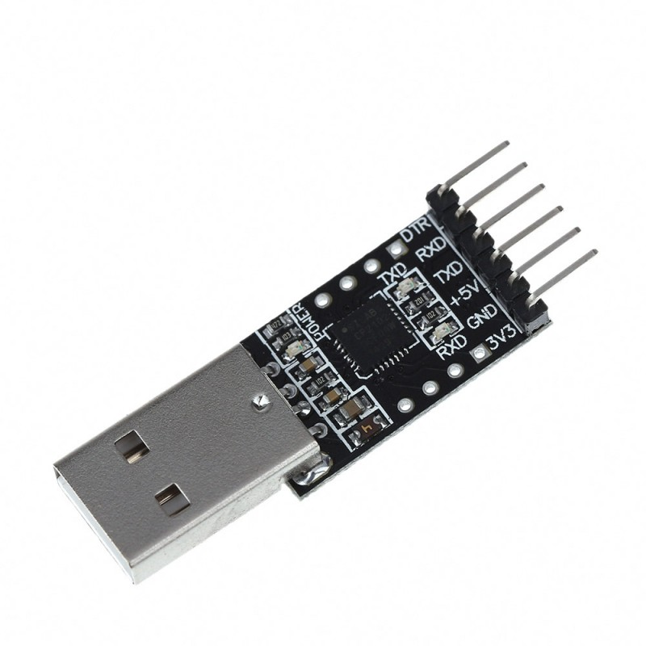

- Преобразователь логических уровней 5В - 3,3В;

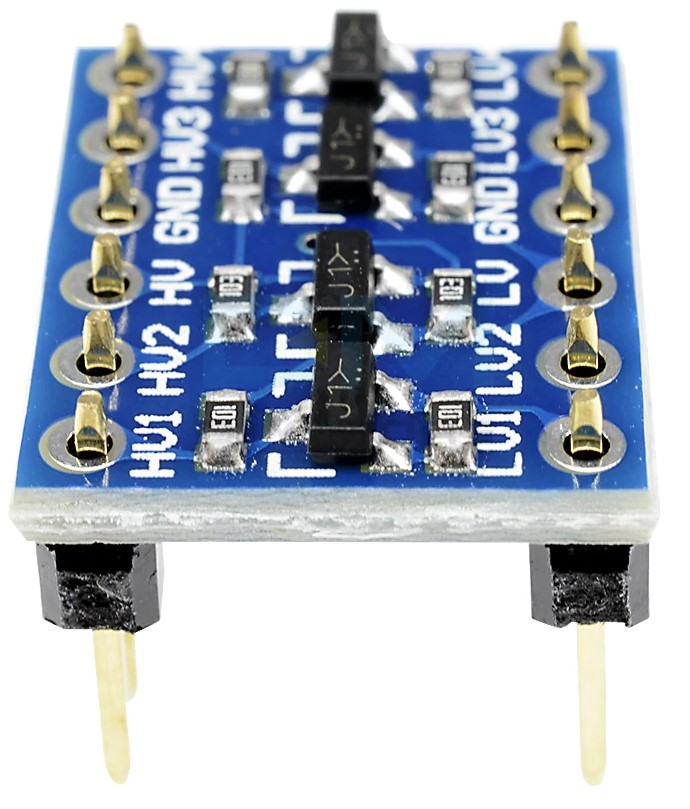

- Провода для макетных плат

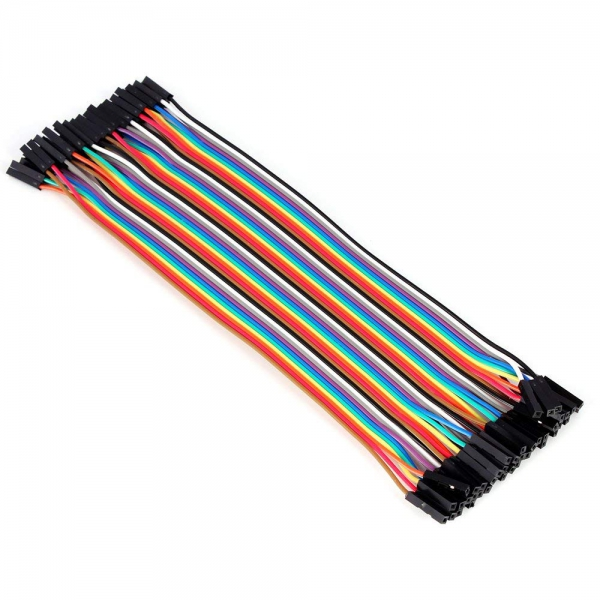

### Формат входного файла
Для обучени и запуска сети требуется сформировать корректный входной файл. Примеры таких файлов находятся в директории data (inputT.txt и inputH.txt). 
```
number
9
memory
110000011
110000011
110000011
110000011
111111111
110000011
110000011
110000011
110000011
memory
111111111
000010000
000010000
000010000
000010000
000010000
000010000
000010000
000010000
test
110000011
110000011
110000011
110000011
111111111
111111111
110000011
110000011
110001111
```

Файл содержит 3 секции:
- Секция `number` отвечает за размер стороны входного образа. Соответственно будет создано `number^2` нейронов;
- Секция `memory` содержит в себе сохраняемы образ. В файле может содержаться несколько секций `memory`;
- Секция `test` содержит в себе образ, который будет передан на вход.

Образы записываются в виде наборов строк из 0 и 1, где каждый 0 означает состояние входа -1, а 1 состояние +1.

### Формирование весов сети
Перед началом работы скачайте или клонируйте проект в требуюмую вам директорию. Использую командную строку перейдите в директорию, содержащую проект.

Для запуска обучения сети выполните следующую последовательность команд:
```cmd
cd HopfieldFPGA
cd python_src
python net.py {input_filename.txt}
```
input_filename.txt — путь к входному файлу.

Для проверки работы сети возможно воспользоваться пробными файлами, которые находяться в директории data. Пример запуска пробной задачи.
```cmd
python net.py ../data/inputT.txt
```

В результате удачного выполнения должно было появиться следующее окно:

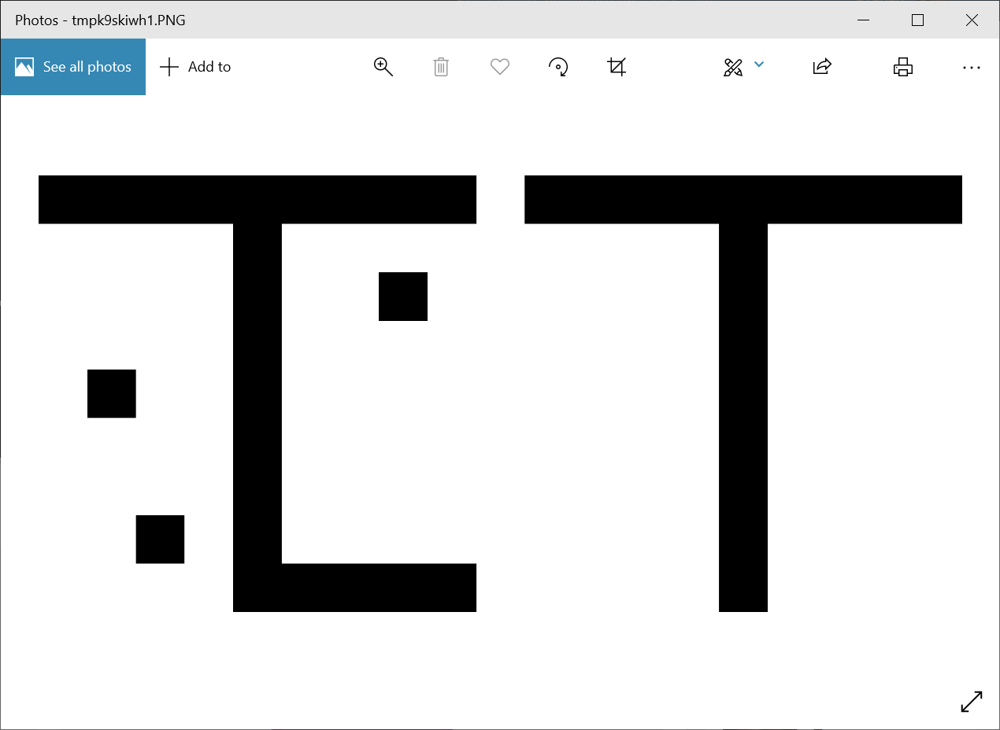

Изобрадение слева показывает входной образ. Изображение справа показывает распознанный образ из памяти.

После обучения сети в папке data должны были появиться или обновиться файлы input.hex, testbench_input.hex и weights.hex. В дальнейшем эти файлы могут быть использованы для запуска симуляции или для работы на плате.

### Симуляция

Симуляция работы сети проводиться с использованием Icarus Verilog. Для визулизации результатов используется утилита gtkwave. Для запуска симуляции требуется перейти в директорию scripts и запустить сценарий `start_iverilog.bat`. Используйте для этого следующие команды:
```cmd
cd ../scripts/
start_iverilog.bat
```
В повившемся окне можно выбрать, какие сигналы каких буду отображены и с каким масштабом. Пример такого изображения приведен ниже:

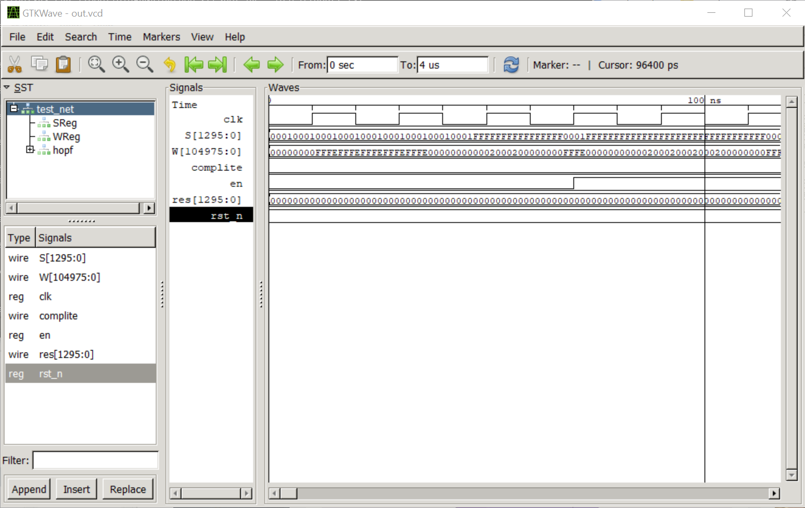

### Запуск на плате
Сборка и загрузка проекта на плату производится с использованием среды Quartus. Откройте файл проекта `hopfname.qpf` и запустите сборку проекта. 

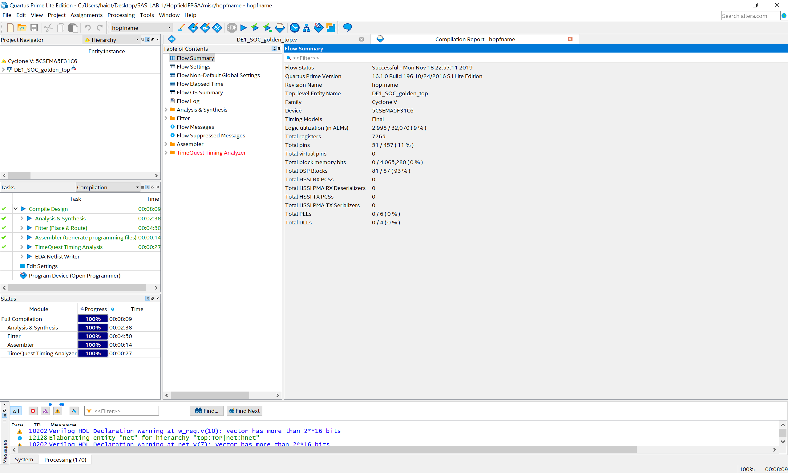

Помимо подключения платы для загрузки проекта требуется подключить ее для передачи данных по UART. Используйте для этого преобразователь логического уровня, преобразователь USB - UART и провода для макетных плат. Схема подключения приведена ниже:

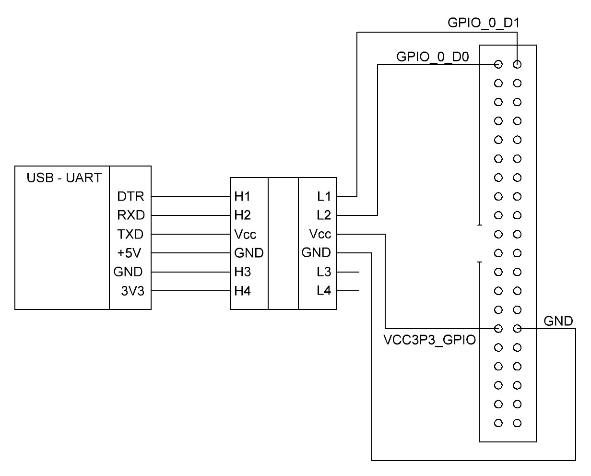

После подключения платы по UART загрузите проект на плату и запустите программу отправки данных. Перед запуском программы следует уточнить COM порт подключения UART преобразователя. Это возможно сделать через мэнеджер устройств Windows. Для запуска передачи используйте следующие команды (звездочкой обозначен номер порта):

```cmd
cd ../pytho_src/
python uart.py COM{*}
```

После успешной передачи результат работы отобразиться на экране аналогично запуску файла `net.py`.

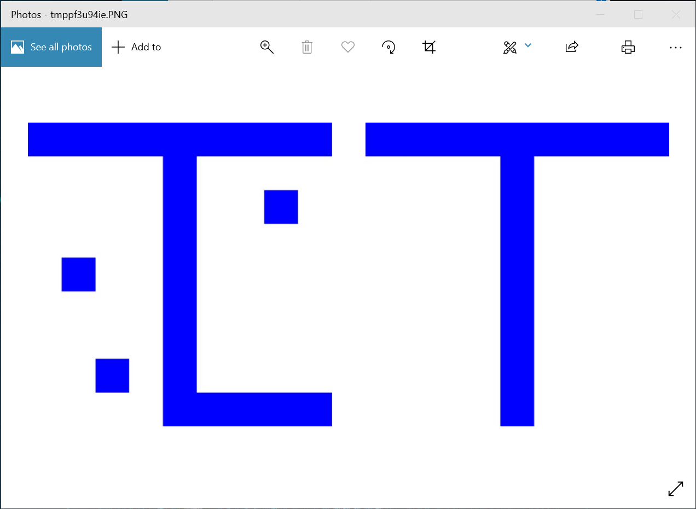

Для повторного запуска распознавания образа нажмите на плате кнопку KEY_0 для сброса.

## Ссылки

[[1](https://microtechnics.ru/nejronnaya-set-xopfilda/)] https://microtechnics.ru/nejronnaya-set-xopfilda/

[[2](https://youtu.be/W7ux1RfOQeM)] https://youtu.be/W7ux1RfOQeM

[[3](https://habr.com/ru/post/301406/)] https://habr.com/ru/post/301406/

[[4](https://ru.wikipedia.org/wiki/Универсальный_асинхронный_приёмопередатчик)] https://ru.wikipedia.org/wiki/Универсальный_асинхронный_приёмопередатчик

 [[5](https://www.nandland.com/vhdl/modules/module-uart-serial-port-rs232.html)] https://www.nandland.com/vhdl/modules/module-uart-serial-port-rs232.html

 


